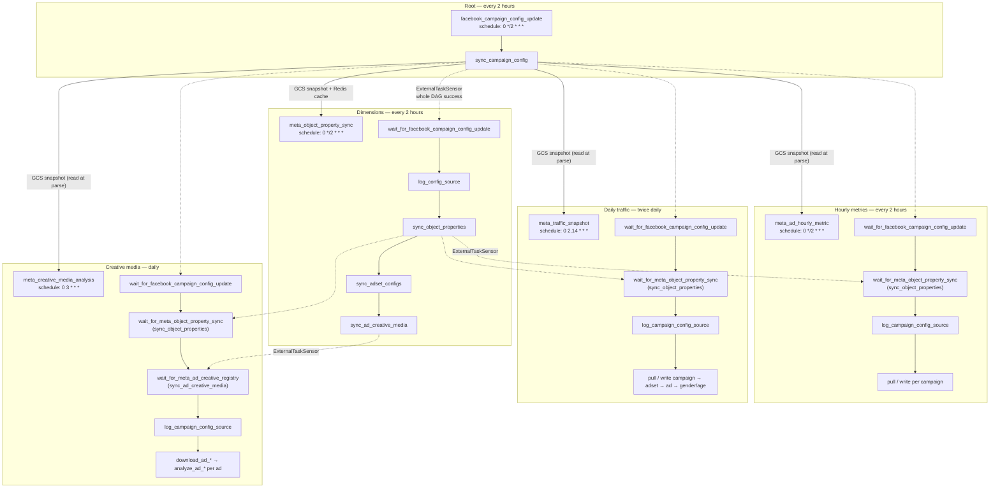
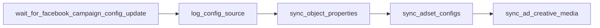
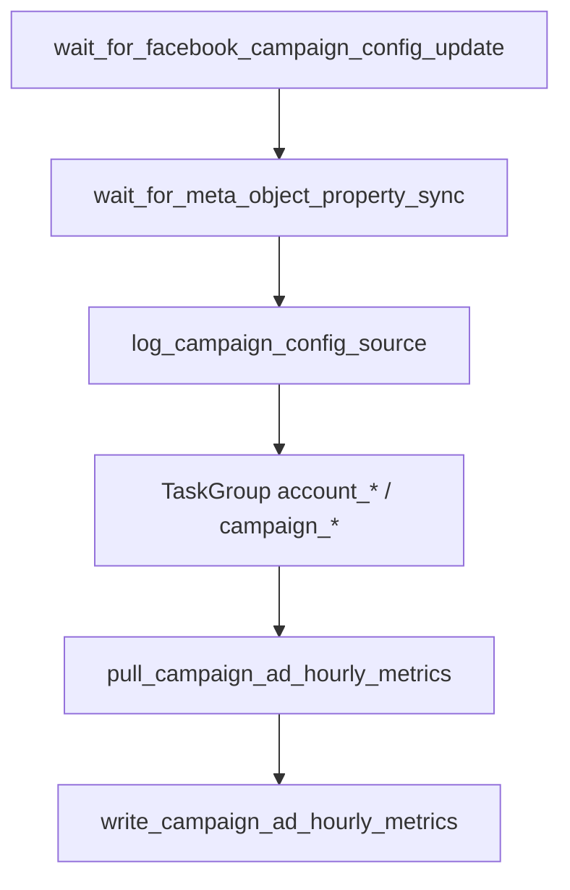
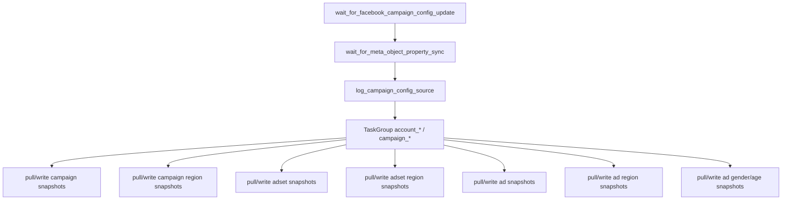
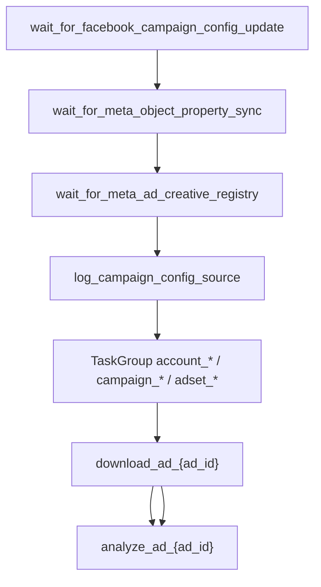

# Meta Airflow DAGs — ordering, tasks, and dependencies

All Meta marketing DAGs share a **2-hour partition** in `America/Los_Angeles`
(see [`campaign_config_logical_date`](../dags/meta_gcs.py)). Downstream DAGs use
`ExternalTaskSensor` with `execution_date_fn=campaign_config_logical_date` so each
run waits for the **matching** `facebook_campaign_config_update` bucket—not merely
“the latest” run.

Shared helpers live in [`meta_gcs.py`](../dags/meta_gcs.py) (GCS pointers, tokens,
partition math) and [`meta_status.py`](../dags/meta_status.py) (Redis config cache,
`active_status` for metrics).

---

## Cross-DAG relationship (mermaid)



### Data flow (what each layer produces)

| Layer | DAG | Primary outputs |
| --- | --- | --- |
| Config | [`facebook_campaign_config_update`](../dags/facebook_campaign_config_update.py) | GCS `facebook_campaign_config_update/.../snapshot.json`, `latest_success.json`, Redis `meta:campaign_config:*` |
| Dimensions | [`meta_object_property_sync`](../dags/meta_object_property_sync.py) | Postgres `marketing.meta_campaign`, `meta_adset`, `meta_ad`, `meta_adset_config`, `meta_ad_creative` |
| Hourly metrics | [`meta_ad_hourly_metric`](../dags/meta_ad_hourly_metric.py) | Postgres `marketing.meta_ad_hourly_metric` |
| Daily snapshots | [`meta_traffic_snapshot`](../dags/meta_traffic_snapshot.py) | Postgres `marketing.meta_*_daily_snapshot`, `meta_*_region_daily_snapshot`, `meta_ad_gender_age_daily_snapshot` |
| Backfills | [`meta_region_snapshot_backfill`](../dags/meta_region_snapshot_backfill.py), [`meta_campaign_config_backfill`](../dags/meta_campaign_config_backfill.py) | Region snapshot backfill rows, GCS config inventory report |
| Media analysis | [`meta_creative_media_analysis`](../dags/meta_creative_media_analysis.py) | GCS `meta_analysis/...` via MCP, Postgres `marketing.creative_media_analysis_*` |

---

## DAG reference

### 1. `facebook_campaign_config_update`

**Code:** [`dags/facebook_campaign_config_update.py`](../dags/facebook_campaign_config_update.py)  
**Schedule:** `0 */2 * * *` (12×/day, on the hour, Pacific)  
**Module:** [`merino_meta_jobs/account_snapshot.py`](../module/meta/merino_meta_jobs/account_snapshot.py)


| Task | What it does |
| --- | --- |
| `sync_campaign_config` | Pulls current Meta account → campaign → adset → ad tree via Graph API; writes partitioned snapshot to GCS; publishes `latest_success.json`; caches snapshot in Redis via [`cache_config_snapshot`](../dags/meta_status.py). |

**Downstream:** Every other Meta DAG either sensors this run or reads the GCS pointer / snapshot JSON.

---

### 2. `meta_object_property_sync`

**Code:** [`dags/meta_object_property_sync.py`](../dags/meta_object_property_sync.py)  
**Schedule:** `0 */2 * * *`  
**Modules:** [`object_property.py`](../module/meta/merino_meta_jobs/object_property.py), [`adset_config.py`](../module/meta/merino_meta_jobs/adset_config.py), [`ad_creative.py`](../module/meta/merino_meta_jobs/ad_creative.py)



| Task | What it does |
| --- | --- |
| `wait_for_facebook_campaign_config_update` | Waits for the aligned `facebook_campaign_config_update` run (whole DAG success). |
| `log_config_source` | Logs GCS pointer / snapshot URI and object counts (parse-time snapshot). |
| `sync_object_properties` | Upserts campaign, adset, ad dimensions into Postgres (incremental from GCS snapshot, or full init when `meta_object_property_full_init=true`). **Metric DAGs sensor this task.** |
| `sync_adset_configs` | Fetches ad set `targeting` plus budget/config fields from Graph; writes targeting SCD history in `marketing.meta_adset_config`, daily targeting partitions in `marketing.meta_adset_targeting_daily_snapshot`, and budget-change history in `marketing.meta_adset_budget_history`. |
| `sync_ad_creative_media` | Fetches `/adcreatives` per ad; upserts `marketing.meta_ad_creative` (`has_video`, `has_image`, `video_ids`). **Not a media download**—Graph metadata only. |

---

### 3. `meta_ad_hourly_metric`

**Code:** [`dags/meta_ad_hourly_metric.py`](../dags/meta_ad_hourly_metric.py)  
**Schedule:** `0 */2 * * *`  
**Module:** [`traffic.py`](../module/meta/merino_meta_jobs/traffic.py)



| Task | What it does |
| --- | --- |
| `wait_for_*` | Same 2-hour alignment; property sensor targets `sync_object_properties` only (does not wait for adset config or creative registry). |
| `log_campaign_config_source` | Logs filtered account/campaign/adset counts from GCS config. |
| `pull_campaign_ad_hourly_metrics` | Meta Insights API, ad level, advertiser-time-zone hourly breakdown for configured adsets. |
| `write_campaign_ad_hourly_metrics` | Upserts `marketing.meta_ad_hourly_metric`. |

Task groups: `account_{id}` → `campaign_{id}` → pull/write pair.

---

### 4. `meta_traffic_snapshot`

**Code:** [`dags/meta_traffic_snapshot.py`](../dags/meta_traffic_snapshot.py)  
**Schedule:** `0 2,14 * * *` (02:00 and 14:00 Pacific)  
**Module:** [`traffic.py`](../module/meta/merino_meta_jobs/traffic.py)



| Task pair (per campaign) | Postgres table |
| --- | --- |
| `pull_campaign_snapshots` → `write_campaign_snapshots` | `marketing.meta_campaign_daily_snapshot` |
| `pull_campaign_region_snapshots` → `write_campaign_region_snapshots` | `marketing.meta_campaign_region_daily_snapshot` |
| `pull_adset_snapshots` → `write_adset_snapshots` | `marketing.meta_adset_daily_snapshot` |
| `pull_adset_region_snapshots` → `write_adset_region_snapshots` | `marketing.meta_adset_region_daily_snapshot` |
| `pull_ad_snapshots` → `write_ad_snapshots` | `marketing.meta_ad_daily_snapshot` |
| `pull_ad_region_snapshots` → `write_ad_region_snapshots` | `marketing.meta_ad_region_daily_snapshot` |
| `pull_ad_gender_age_snapshots` → `write_ad_gender_age_snapshots` | `marketing.meta_ad_gender_age_daily_snapshot` |

### 6. `meta_campaign_config_backfill`

**Code:** [`dags/meta_campaign_config_backfill.py`](../dags/meta_campaign_config_backfill.py)  
**Schedule:** `0 4 * * *` (daily 04:00 Pacific; keep paused — use trigger/backfill only)  
**Module:** [`campaign_config_backfill.py`](../module/meta/merino_meta_jobs/campaign_config_backfill.py)

Reads historical `facebook_campaign_config_update/.../snapshot.json` from GCS,
builds per-snapshot campaign/adset/ad counts, and writes an inventory report to
`gs://airflow-run-us-west2/meta_campaign_config_backfill/<date>/<datetime>/snapshot.json`.

- **UI Backfill:** one report per logical date in the selected range.
- **Single Run (no conf):** full scan of every snapshot (union inventory).
- **Single Run conf:** `{"start_date":"2026-01-01","end_date":"2026-06-10"}` for a custom range.

Use this before metric backfills: dimension tables `marketing.meta_campaign` /
`meta_adset` / `meta_ad` only store the latest object state, not historical status
timelines. Optional env: `CAMPAIGN_CONFIG_BACKFILL_MAX_SNAPSHOTS` to limit scan size.

---

### 7. `meta_region_snapshot_backfill`

**Code:** [`dags/meta_region_snapshot_backfill.py`](../dags/meta_region_snapshot_backfill.py)  
**Schedule:** manual (`schedule=None`)  
**Module:** [`region_snapshot_backfill.py`](../module/meta/merino_meta_jobs/region_snapshot_backfill.py)

Backfills Meta `region` breakdown tables from the dimension tables:

- `marketing.meta_campaign_region_daily_snapshot`
- `marketing.meta_adset_region_daily_snapshot`
- `marketing.meta_ad_region_daily_snapshot`

This DAG is independent from GCS scans and full object-property init. It reads
existing rows in `marketing.meta_campaign`, `marketing.meta_adset`, and
`marketing.meta_ad`, then uses each entity's `created_at` plus the requested date
range to plan work. If `created_at` is missing, it falls back to the requested
`start_date`.

Manual DAG conf:

```json
{
  "start_date": "2026-01-01",
  "end_date": "2026-06-10",
  "account_ids": ["act_4157857287789311"],
  "levels": ["campaign", "adset", "ad"],
  "force": false
}
```

Planning rules:

- `force=false` skips entity/date pairs that already exist in the region target table.
- Campaign/adset/ad lower bounds come from `created_at` and parent entity `created_at` values.
- Campaign batches are grouped by account/date.
- Adset and ad batches are grouped by account/campaign/date.
- Chunk sizes default to 50 and can be changed with
  `META_REGION_BACKFILL_CAMPAIGN_CHUNK_SIZE`,
  `META_REGION_BACKFILL_ADSET_CHUNK_SIZE`, and
  `META_REGION_BACKFILL_AD_CHUNK_SIZE`.

Validation queries:

```sql
SELECT report_date, COUNT(*) AS rows
FROM marketing.meta_campaign_region_daily_snapshot
GROUP BY report_date
ORDER BY report_date;

SELECT report_date, COUNT(*) AS rows
FROM marketing.meta_adset_region_daily_snapshot
GROUP BY report_date
ORDER BY report_date;

SELECT report_date, COUNT(*) AS rows
FROM marketing.meta_ad_region_daily_snapshot
GROUP BY report_date
ORDER BY report_date;
```

The planner does not require `start_time` / `stop_time` schedule fields. This can
plan some no-delivery dates, but Meta Insights returns no region rows for those
dates and the upsert writes nothing.

---

### 8. `meta_creative_media_analysis`

**Code:** [`dags/meta_creative_media_analysis.py`](../dags/meta_creative_media_analysis.py)  
**Schedule:** `0 3 * * *` (daily 03:00 Pacific)  
**Module:** [`media_analysis.py`](../module/meta/merino_meta_jobs/media_analysis.py) (HTTP client to media-analysis-mcp)



| Task | What it does |
| --- | --- |
| `wait_for_meta_ad_creative_registry` | Waits for `sync_ad_creative_media` (creative **registry** in Postgres, not MCP download). |
| `download_ad_{ad_id}` | POST to media-analysis-mcp `/api/v1/download-ad-creative-assets` — downloads video/image assets, frames, optional GCS upload (`meta_analysis` bucket). |
| `analyze_ad_{ad_id}` | POST to `/api/v1/creative-media-analysis` — LLM analysis; upserts `marketing.creative_media_analysis_snapshot` and traffic link rows. |

Ad selection at parse time uses the GCS config snapshot ([`media_analysis_ads_from_adset`](../module/meta/merino_meta_jobs/traffic.py)), not `marketing.meta_ad_creative` (registry is ordering + Metabase; filtering on `has_video` / `has_image` is planned).

Per-ad chain: `download_ad_* >> analyze_ad_*`.

---

## ExternalTaskSensor cheat sheet

| Waiting DAG | Sensor task | Waits on DAG | Waits on task |
| --- | --- | --- | --- |
| `meta_object_property_sync` | `wait_for_facebook_campaign_config_update` | `facebook_campaign_config_update` | *(entire DAG)* |
| `meta_ad_hourly_metric` | `wait_for_facebook_campaign_config_update` | `facebook_campaign_config_update` | *(entire DAG)* |
| `meta_ad_hourly_metric` | `wait_for_meta_object_property_sync` | `meta_object_property_sync` | `sync_object_properties` |
| `meta_traffic_snapshot` | same as hourly | same | `sync_object_properties` |
| `meta_creative_media_analysis` | `wait_for_facebook_campaign_config_update` | `facebook_campaign_config_update` | *(entire DAG)* |
| `meta_creative_media_analysis` | `wait_for_meta_object_property_sync` | `meta_object_property_sync` | `sync_object_properties` |
| `meta_creative_media_analysis` | `wait_for_meta_ad_creative_registry` | `meta_object_property_sync` | `sync_ad_creative_media` |

Alignment function: [`campaign_config_logical_date`](../dags/meta_gcs.py) in every sensor above.

---

## Typical timeline (one 2-hour bucket)

```mermaid
gantt
  title Meta pipeline (example 02:00 Pacific bucket)
  dateFormat HH:mm
  axisFormat %H:%M

  section Config
  facebook_campaign_config_update     :a1, 02:00, 20m

  section Dimensions
  meta_object_property_sync           :a2, after a1, 45m

  section Metrics
  meta_ad_hourly_metric               :a3, after a2, 60m

  section Daily only
  meta_traffic_snapshot (if 02:00 run) :a4, after a2, 90m
  meta_creative_media_analysis (03:00) :a5, 03:00, 120m
```



- **02:00 bucket:** config → dimensions → hourly (and traffic snapshot when scheduled).
- **03:00 daily:** creative media analysis waits for the **02:00** config/dimension/creative-registry bucket via `campaign_config_logical_date`, then downloads and analyzes ads.

---

---

## `shopify_import`

| | |
| --- | --- |
| **Schedule** | `0 */12 * * *` (every 12 hours, UTC) |
| **Image** | `us-west2-docker.pkg.dev/merino-agent/merino/merino-shopify-cli:0.1.2` |
| **Executor** | `KubernetesPodOperator` in namespace `airflow` (KSA `merino-airflow-task-runner`) |

### Tasks

| Task | Description |
| --- | --- |
| `import_shopify` | Runs `scripts/run_shopify_all.sh`: customers → orders → inventory. Default customer/order query uses `updated_at` over the Airflow 12h interval with a 30-minute overlap (incremental, not 2-day rescan); inventory uses the current run date as `partition_date`. Skips rows already in Postgres unless `--overwrite`. |

### Secrets and connections

- Postgres: Airflow connection `merino_analytics` → `POSTGRES_*` env (database `merino-shopify`)
- Geocoding: Kubernetes secret `merino-airflow-google-geocoding-api-key` key `api-key`, synced from
  GSM secret `airflow-variables-google_geocoding_api_key`.
  Required for the **customers** step only (Google Geocoding API → lat/lng → H3). Not used by inventory
  or by local `backfill_h3.py` (that job reads existing lat/lng from Postgres and computes H3 locally).
- Shopify CLI store auth: K8s secret `shopify-cli-store-auth` copied from `/mnt/shopify-cli-auth` into a writable `emptyDir` at `/root/.config/shopify-cli-store-nodejs` (init container; Shopify CLI must write there). Sync with `terraform/scripts/sync-shopify-cli-auth-secret.sh`

### Manual backfill config

```json
{
  "from_date": "2026-06-01",
  "to_date": "2026-06-14",
  "partition_date": "2026-06-14",
  "overwrite": true
}
```

---

## `shopify_order_transactions`

| | |
| --- | --- |
| **Schedule** | `0 */6 * * *` (every 6 hours, UTC) |
| **Image** | `us-west2-docker.pkg.dev/merino-agent/merino/merino-shopify-cli:0.1.2` |
| **Executor** | `KubernetesPodOperator` in namespace `airflow` (KSA `merino-airflow-task-runner`) |

### Tasks

| Task | Description |
| --- | --- |
| `import_shopify_order_transactions` | Runs `python3 shopify/import_order_transactions.py` against orders updated in the Airflow interval with a 48-hour overlap. Upserts `shopify.order_transactions` and replaces `shopify.order_transaction_fees` rows for each refreshed transaction. |

### Manual Backfill Config

```json
{
  "from_date": "2026-05-01",
  "to_date": "2026-07-03"
}
```

DAG definition: [`shopify_import.py`](../dags/shopify_import.py), pod helper: [`shopify_k8s.py`](../dags/shopify_k8s.py).

---

## Related docs

- Repo layout: [`structure.md`](structure.md)
- Legacy hourly traffic notes: [`meta_traffic_hourly.md`](meta_traffic_hourly.md) *(older DAG name; live DAG is `meta_ad_hourly_metric`)*
- Postgres tables: [`../../metabase_schema/docs/schema.md`](../../metabase_schema/docs/schema.md)
